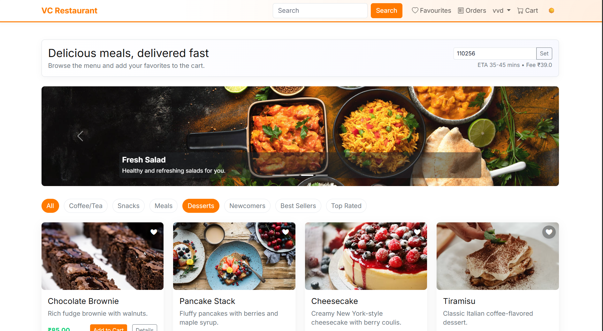

⚡VC Food — Django Food Ordering Website
---
A simple food ordering site built with Django, Bootstrap, and SQLite (MySQL-ready).Supports menu browsing, cart, checkout, order history, wishlist, and user authentication.


📦 Features
---
### 🍽 Menu & Food Ordering

- View dishes and categories

- Dish details page

- Add/remove items from cart

- Wishlist support

### 🛒 Checkout & Orders

- Order summary

- Payment placeholder (extendable)

- Order history per user

### 👤 Authentication

- Django Allauth-style login/signup

- Password reset

- Admin panel

### ⚙️ Admin

- Add/edit/delete dishes

- Manage categories

- Manage user orders


🔗 Live Demo
---
[Live Demo](https://vc-restaurant-228.onrender.com)


📸 𝐃𝐞𝐦𝐨 𝐒𝐜𝐫𝐞𝐞𝐧𝐬𝐡𝐨𝐭
---
Laptop View
---



Moblie View
---


### Quickstart
---

1. Create and activate a virtual environment.
2. Install dependencies:
   ```bash
   pip install -r requirements.txt
   ```
3. Run migrations and create a superuser:
   ```bash
   python manage.py migrate
   python manage.py createsuperuser
   ```
4. Start the server:
   ```bash
   python manage.py runserver
   ```

Visit `/admin/` for admin, `/accounts/login/` to log in, and `/` for the menu.


💾 Default Database (SQLite)
---

The project uses SQLite during development for simplicity.
To use MySQL, review the section below.


## Switch to MySQL later
---
- Install `mysqlclient`
- Set environment variables (e.g., in your shell):
  - `DB_ENGINE=mysql`
  - `MYSQL_DATABASE`, `MYSQL_USER`, `MYSQL_PASSWORD`, `MYSQL_HOST`, `MYSQL_PORT`
- Run migrations again.


🙌 𝐂𝐨𝐧𝐭𝐫𝐢𝐛𝐮𝐭𝐢𝐧𝐠
---

- Feel free to fork and send pull requests! For big changes, open an issue first.

📄 𝐋𝐢𝐜𝐞𝐧𝐬𝐞
---

MIT License
---

Copyright (c) 2025 Vignesh P

Permission is hereby granted, free of charge, to any person obtaining a copy
of this software and associated documentation files (the "Software"), to deal
in the Software without restriction, including without limitation the rights
to use, copy, modify, merge, publish, distribute, sublicense, and/or sell
copies of the Software, and to permit persons to whom the Software is
furnished to do so, subject to the following conditions:

The above copyright notice and this permission notice shall be included in
all copies or substantial portions of the Software.

THE SOFTWARE IS PROVIDED "AS IS", WITHOUT WARRANTY OF ANY KIND, EXPRESS OR
IMPLIED, INCLUDING BUT NOT LIMITED TO THE WARRANTIES OF MERCHANTABILITY,
FITNESS FOR A PARTICULAR PURPOSE AND NONINFRINGEMENT. IN NO EVENT SHALL THE
AUTHORS OR COPYRIGHT HOLDERS BE LIABLE FOR ANY CLAIM, DAMAGES OR OTHER
LIABILITY, WHETHER IN AN ACTION OF CONTRACT, TORT OR OTHERWISE, ARISING FROM,
OUT OF OR IN CONNECTION WITH THE SOFTWARE OR THE USE OR OTHER DEALINGS IN
THE SOFTWARE
